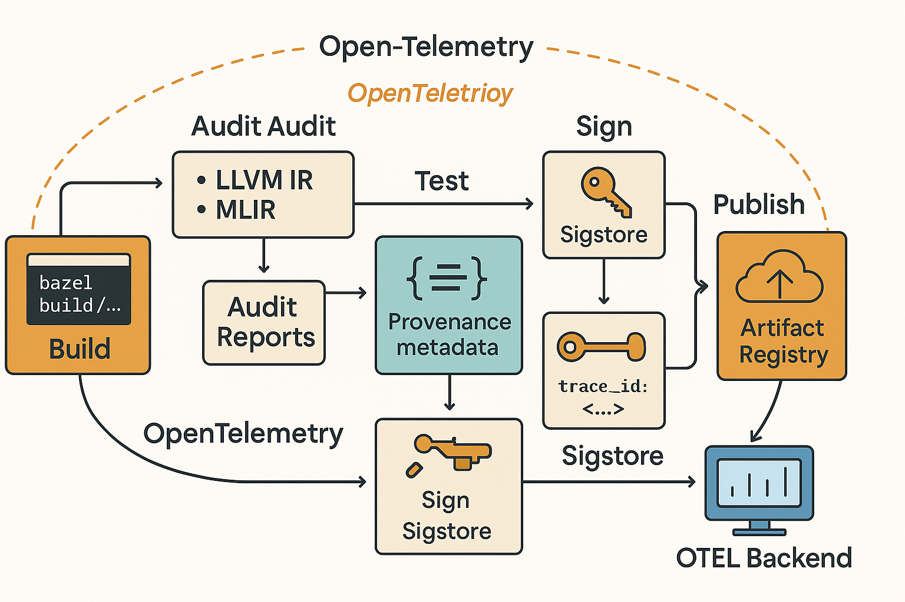

# NLSAFE: Verifiable Build Infrastructure for AI Safety

NLSAFE is an applied research initiative to design and implement cryptographically verifiable, reproducible build pipelines for high-assurance AI systems. It supports SLSA-compliant provenance, static introspection at the IR level, artifact traceability, and secure CI/CD deployment workflows.

This work is foundational to ensuring the safe and accountable use of machine learning models in regulated and safety-critical contexts.

## 🧩 System Architecture

## 🔬 Projects

- [`llvm_ir_analyzer`](./llvm_ir_analyzer): Static IR-level scanner for unsafe memory patterns (Rust, LLVM IR).
- [`mlir_audit_tool`](./mlir_audit_tool): MLIR dialect-aware audit tool for dynamic ops and layout violations (Rust, MLIR).
- [`bep_to_slsa`](./NLSAFE_integration_layer/provenance/bep_to_slsa): Transformer that converts Bazel Build Event Protocol (BEP) data into SLSA provenance format for cryptographically verifiable build records (Rust).

## 📊 Project Tracker

See `/tracker` for task-level planning and implementation details.
# NLSAFE
